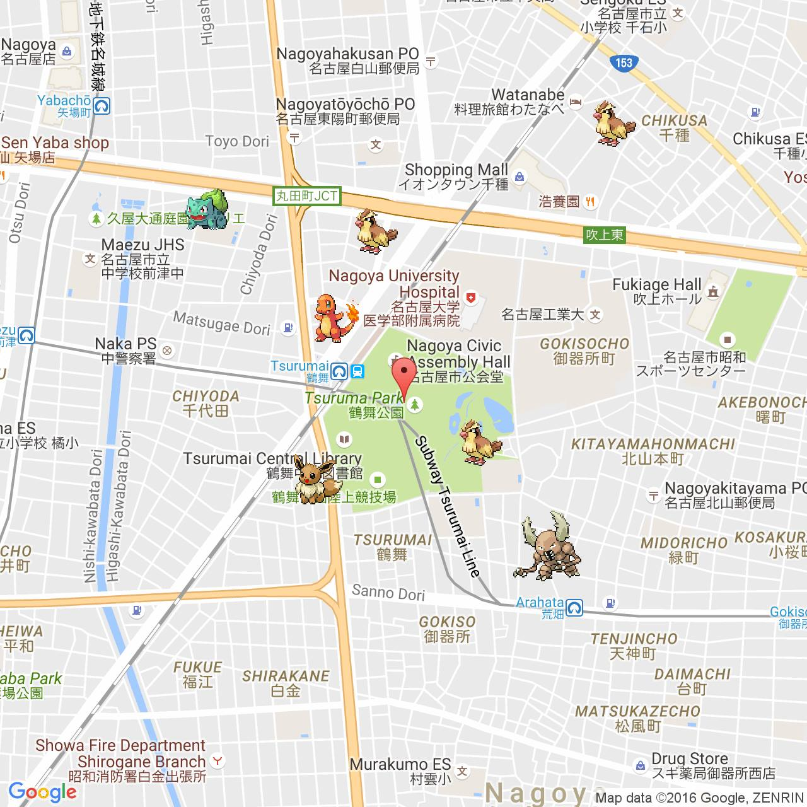

# Usage
* [`cat`](#cat)
* [`color`](#color)
* [`emoji`](#emoji)
* [`help`](#help)
* [`meme`](#meme)
* [~~`pokemon`~~](#pokemon)
* [`stock`](#stock)
* [`weather`](#weather)

--------------------------------------------------
<a name="cat"/>

## @cat

This sends a cat picture to the message thread.


__Usage__

`@cat`

`@cat ["gif"]`

__Arguments__

* `gif`: Sends an animated gif instead of a static png.

__Example__

>`@cat`

*This will send a cat picture.*

>`@cat gif`

*This will send an animated cat picture.*

--------------------------------------------------
<a name="color"/>

## @color

This sets the color of a chat thread.

__Usage__

`@color <RGB Hex>`

__Arguments__

* `RGB Hex`: A six digit hexadecimal number representing the target color. Both upper and lower cases are supported.

__Example__

>`@color #0084FF`

*This will set the chat thread color to Facebook messenger blue.*

--------------------------------------------------
<a name="emoji"/>

## @emoji

This sets the emoji of a chat thread.

__Usage__

`@emoji <emoji | description>`

__Arguments__

* `emoji`: The emoji you want the chat's to be set to.
* `description`: A description of the emoji you want. The bot will use sp00ky NLP (not really) to determine the emoji to use.

__Example__

>`@emoji dog`

*This will set the chat emoji to the dog emoji.*

--------------------------------------------------
<a name="help"/>
## @help

This lists available commands and lists information about each one.

__Usage__

`@help`

`@help [command]`

__Arguments__

* `command` (optional): Name of one of available commands

__Examples__

>`@help`

>`@help weather`

--------------------------------------------------
<a name="meme"/>

## @meme

This sends the thread a [rickroll YouTube link](https://www.youtube.com/watch?v=dQw4w9WgXcQ).

[](http://www.youtube.com/watch?v=dQw4w9WgXcQ)

__Usage__

`@meme`

__Arguments__

None

__Example__

>`@meme`

>https://www.youtube.com/watch?v=dQw4w9WgXcQ


*Never gonna give you up, never gonna let you down. Never gonna run around and desert you. Never gonna make you cry, never gonna say goodbye. Never gonna tell a lie and hurt you…*

--------------------------------------------------
<a name="pokemon"/>

## ~~@pokemon~~

_Deprecated on August 1st, 2016. A change in Niantic backend structure has disabled Pokevision._

~~This retrieves a list of Pokémon from Pokémon Go which are near the user's last dropped location pin. If a list of Pokémon id's are provided, it displays a map with the Pokémon drawn on it.~~

~~__Usage__~~

~~`@pokemon`~~

~~`@pokemon <id1, id2, ... id5>`~~

~~__Arguments__~~

* ~~`id` (up to 5): The Pokémon id's to draw the location of.~~

~~__Example__~~

>~~`@pokemon`~~
```
Pokemon nearby:
#1 Bulbasaur:          1 found
#4 Charmander:         1 found
#13 Weedle:             2 found
#16 Pidgey:             3 found
#19 Rattata:            2 found
#21 Spearow:            1 found
#41 Zubat:              1 found
#48 Venonat:            4 found
#55 Golduck:            1 found
#60 Poliwag:            2 found
#69 Bellsprout:         1 found
#127 Pinsir:             1 found
#133 Eevee:              1 found
```
>~~`@pokemon 1 4 16 127 133`~~

> 

--------------------------------------------------
<a name="stock"/>

## @stock

This retrieves stock data for a given stock.

__Usage__

`@stock <symbol>`

__Arguments__

* `symbol`: Stock symbol. (Currently only supporting US stocks)

__Example__

>`@stock GOOGL`

>Alphabet Inc. (GOOGL) last traded at $757.52 on Mon Jul 25 2016 00:00:00 GMT-0700 (Pacific Daylight Time).
Volume: 1073278 | P/E Ratio: 30.82
Change: $-1.76 | % Change: -0.23%

--------------------------------------------------
<a name="weather"/>

## @weather

This posts weather information of a given location.

__Usage__

`@weather <zipcode | location name> > <degree type>`

__Arguments__

* `zipcode`: A five digit US zipcode.
* `location name`: A letter and space only location name, or city name and state separated by a comma and a space.
* `degree type`: A degree type to display the weather, the parameter can be 'C' for Celsius or 'F' for Fahrenheit. The default type is Fahrenheit.

__Example__

>`@weather 94158`

>59°F  
San Francisco, CA  
Mostly Sunny :cloud:  
Feels like 59°. Humidity 90%.  
07-30 | 54°/68°  
07-31 | 56°/69°  :umbrella: 0%  
08-01 | 56°/71°  :umbrella: 10%  
08-02 | 54°/69°  :umbrella: 0%  
08-03 | 54°/69°  :umbrella: 0%  

>`@weather New York, NY`

>73°F  
New York, NY  
Partly Cloudy :cloud:  
Feels like 73°. Humidity 94%.  
07-30 | 72°/80°  
07-31 | 74°/78°  :umbrella: 80%  
08-01 | 72°/79°  :umbrella: 80%  
08-02 | 71°/76°  :umbrella: 80%  
08-03 | 72°/78°  :umbrella: 60%

>`@weather 78701 C`

>37°C  
Austin, TX  
Sunny :sunny:  
Feels like 37°. Humidity 35%.  
07-31 | 24°/35°  
08-01 | 24°/36°  :umbrella: 0%  
08-02 | 26°/37°  :umbrella: 0%  
08-03 | 26°/38°  :umbrella: 0%  
08-04 | 26°/37°  :umbrella: 30%